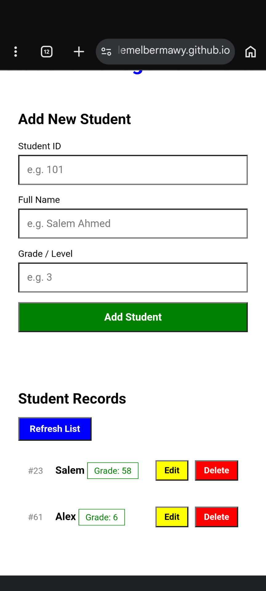
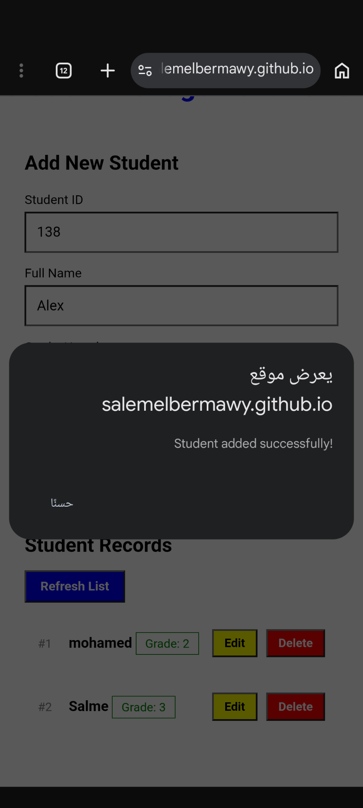
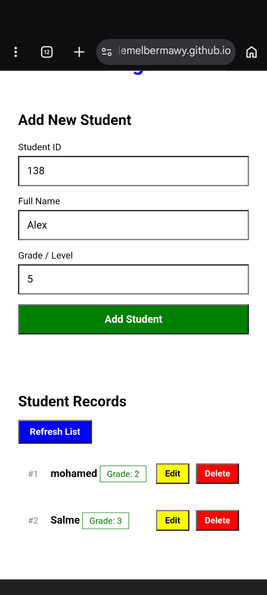
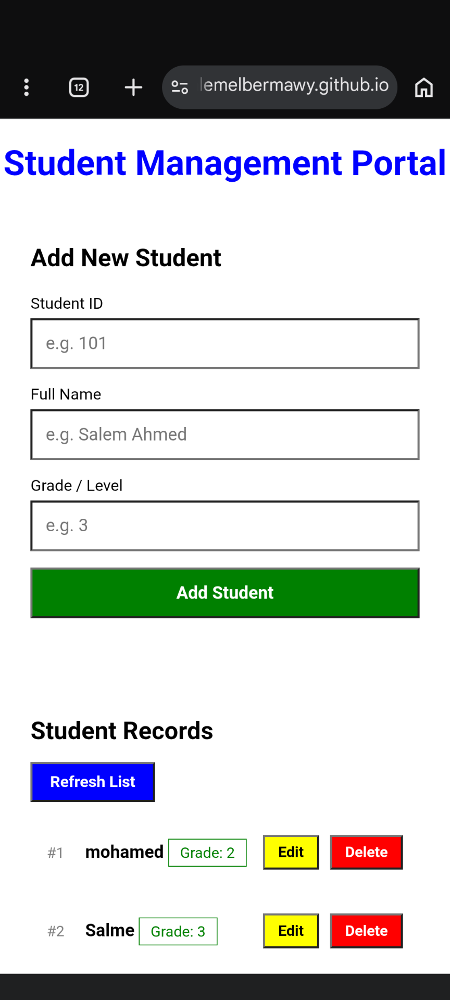

# Students_Management

A dynamic and interactive modern web application designed to manage student records efficiently using CRUD operations. The project connects a responsive Front-End interface with a Back-End API, ensuring fast data processing without full page reloads.

## Demo

You can check out the live preview here:
https://salemelbermawy.github.io/students_management/

---

## Tech Stack

- Front-End: HTML, CSS, JavaScript
- Back-End: Python (FastAPI) hosted on Vercel

## How to Use

- Open the project in your browser
- Add a student by entering their ID, Name, and Grade
- Click the Delete button to remove a student by ID
- Click the Edit button to update a student's information
- All changes are reflected instantly without reloading the page

--- 

## Installation

- No installation needed for the Front-End, just open the live demo link
- To run it locally, clone the repo and run the FastAPI back-end with

---
# Description

This is a dynamic and interactive modern web application designed to manage student records efficiently (CRUD operations). The project provides a seamless user experience by connecting a responsive Front-End interface with a powerful Back-End API, ensuring fast data processing without full page reloads.

## THERE IS NOT DATA BASE 
- I jsut use list or "array" in the backend file as shown in the following figure and this file is hosted on "Vercel"

-And this is a section of the hosted

---

##  Features

- it has adding feature
- you can read and show all students in the list
- you can modefy and update any student in your database
* you can delete, too.

---

* **Front-End:** HTML, CSS JavaScript 
* **Back-End:** Python (FastAPI).

- you can Add students by the ID , Name , Grade
- And you can delete student by id when you click on the delete button

---

- you can also edit student info 
